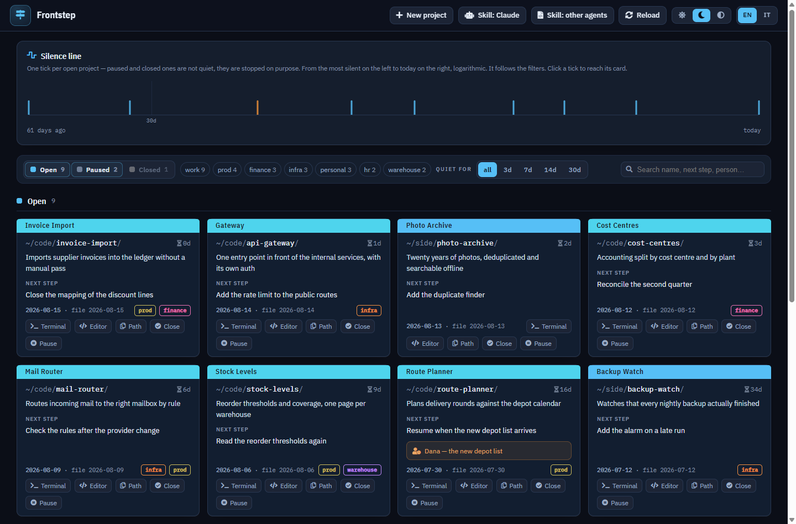

# Frontstep

**One page with the state of every project you have.** Which fronts are open, what the next step
is, who you are waiting on, and how many days each one has been silent.

## The point: you do nothing, and the page is right

Frontstep ships **a skill for your coding agent**, and the skill tells it one thing: keep a
`CURRENT_STATUS.md` in each project up to date, as part of the work, without being asked. At the top
of that file sit six lines — what the project is, who holds the ball, when it last moved, what
happens next — and those are the agent's job too.

Frontstep reads those lines, from every project, and derives one page from them. No database, no
form to fill in, nothing to remember at the end of a session: you work, the agent writes, and the
next time you open the dashboard it already knows where everything stands.

That is the whole idea. **The skill is not an accessory, it is the engine** — install it (see below)
and the thing runs itself. Skip it, and you are back to editing files by hand.

## How it looks



Three sections — open, paused, closed — with a card per project: where it lives, what it is, what
happens next, and how long it has been quiet. The **silence line** across the top is the view no
single file can give: one tick per open project, from the one that has been quiet longest to today,
on a logarithmic axis. It is where you see the tail of things you have stopped thinking about.

Every card carries two buttons that save you a trip: **Terminal** opens one *already inside that
project's folder*, and **Editor** opens its status document, for when you want to fix a line
yourself. The editor is **the one you have chosen**: Frontstep asks the system, it does not name a
program. For the terminal there is no such question to ask outside Windows and Debian-like Linux, so
elsewhere it opens the one your desktop ships with — and one line of configuration overrides it.

Light and dark, following the system unless you say otherwise, and mobile friendly too. The colours
are not chosen by eye — the contrast ratios are computed from the stylesheet's own tokens by a test.

## Install with uv, the easiest path

**macOS and Linux**

```bash
# 1. Download and run Astral's installer for uv — one program that brings its own Python
curl -LsSf https://astral.sh/uv/install.sh | sh

# 2. Install Frontstep with it, straight from this repository
uv tool install https://github.com/GiovanniCst/frontstep/archive/main.zip

# 3. Start it
frontstep serve
```

**Windows**, in PowerShell

```powershell
# 1. Download Astral's installer for uv and run it (irm fetches, iex executes) — uv brings its own Python
irm https://astral.sh/uv/install.ps1 | iex

# 2. Install Frontstep with it, straight from this repository
uv tool install https://github.com/GiovanniCst/frontstep/archive/main.zip

# 3. Start it
frontstep serve
```

Open a new terminal after step 1, since a shell only picks up a new PATH when it starts. If
`frontstep` is still not found, `uv tool update-shell` fixes it for good — and meanwhile
`uv tool dir --bin` prints the folder it was installed into, so running it from there works right
away.

> **What step 1 actually does:** it downloads a script from `astral.sh` and runs it immediately,
> without saving it or showing it to you. It needs no administrator rights and installs into your
> own profile. [Astral](https://astral.sh/) makes uv, Ruff and ty, and **is now part of OpenAI**
> ([March 2026](https://openai.com/index/openai-to-acquire-astral/)) — so that is who you are
> trusting for the length of that one line. uv itself is open source (MIT/Apache-2.0), but reading
> the source is not the same as reading what a URL serves you today. If you would rather not, the
> alternatives below install uv from a package manager instead, or skip it entirely.

<details>
<summary>Why not <code>pip install</code></summary>

Because on a fresh machine it usually cannot run. Measured on stock images, August 2026: Debian 13
and Ubuntu 24.04 ship python3 with neither `pip` nor `ensurepip` — so even `python3 -m venv` fails;
Fedora and Arch base images have no Python at all; and where pip does exist, Debian, Fedora and
Homebrew refuse to install into the system Python (PEP 668).

uv is one static binary with the same three lines everywhere, and the CI runs the first two of them
on six distributions plus Windows and macOS — so this page cannot quietly stop being true.

</details>

That is the whole installation. There are no questions to answer first: `serve` starts without a
configuration and prints an address with a key on the end —

```
Frontstep 0.5.2 — not set up yet.

  Open this, and it will ask you where your projects are:

    http://127.0.0.1:9015/?key=…
```

— and the page offers the folders that are really on your machine, each with **how many folders
inside already have a status document**. Pick one, press Start, and the dashboard is there. Nothing
to restart.

The key is in the address because that page decides which folders Frontstep may read and write.
Whoever can see the terminal started the program; on a shared machine, being able to reach a port is
not the same thing.

Prefer a terminal? `frontstep init` asks the same questions there and writes the same file.

Neither way writes inside your existing projects. `init` also creates one example folder of its own,
whose status document doubles as the tutorial.

In a container, setting up from the browser works too — but the folders it offers are the
container's, so the paths it writes are only right if what you mounted is mounted at the same place.

**It is a local, single-user application.** No authentication, no accounts, no multi-user. It binds
to `127.0.0.1` for that reason and says so out loud if you tell it to bind anywhere else.

Binding to localhost is not the same as being private, though, so two checks stand in front of
everything that writes:

- **it only answers to the name you dialled it by.** Localhost always works; any other name has to
  be listed in `allowed_hosts`. This is what stops a site whose domain resolves to `127.0.0.1` from
  reaching the dashboard as if it were the dashboard;
- **every write carries a token the page is given when it is rendered.** A form on another site
  cannot send that header, and another account on the same machine has never been served the page.
  The token lives in memory and changes at every restart, so a tab left open across one is told to
  reload rather than quietly failing.

Reads are covered by the first check, writes by both. Nothing defends against a program running as
you — it can read your files directly, so there is nothing a token could add.

## Requirements

Nothing to provision: no database, no service to run, no account anywhere.

| | |
|---|---|
| **Python** | **3.11 or newer** — that is where `tomllib` arrived, and the configuration is TOML. uv brings its own, so this only constrains you if you install another way |
| **Dependencies** | three: `Flask`, `mistune`, `MarkupSafe`. `gunicorn` is optional, as the `server` extra, and only if you would rather not use Flask's own server |
| **Operating system** | Linux, macOS, Windows. The CI runs the suite on Ubuntu (3.11→3.14) and on Windows and macOS at both ends of that range, and installs it from the lines above on Debian 13, Ubuntu 24.04, Fedora, Arch, openSUSE and Alpine |
| **Browser** | any current one. The page is server-rendered HTML with a little vanilla JavaScript — no framework, no build step, and it fetches nothing from the internet |
| **Disk** | a few MB, plus whatever Python you install it under |

Frontstep reads the folders you point it at, and everything it writes is listed under **What the
page can write** below. It never needs root, and it binds to `127.0.0.1`.

## Other ways in, for people who prefer their own

Frontstep is an ordinary Python package: **anything that installs one will install it.** These are
not covered by the CI the way the three lines above are, so they are offered as directions rather
than promises.

**Get uv from a package manager**, if you would rather not pipe a script into a shell — then carry
on from step 2 above:

```bash
brew install uv                        # macOS
winget install --id=astral-sh.uv -e    # Windows
pipx install uv                        # anywhere pipx is
```

**Skip uv altogether.** In a virtual environment you made yourself, where PEP 668 has no say:

```bash
python3 -m venv ~/.venvs/frontstep
~/.venvs/frontstep/bin/pip install https://github.com/GiovanniCst/frontstep/archive/main.zip
~/.venvs/frontstep/bin/frontstep serve
```

This one uses **your system's Python**, so it is the one that can fail for a reason none of the
others have: `python3 -m venv` builds the environment around whatever version you happen to have,
and if that is older than 3.11 the install stops with *"requires a different Python"*. Tried on a
machine running 3.10 and that is exactly what it said. `python3 --version` first, or let uv bring
its own.

**From a clone**, which is also how you would run it to change it — see `CONTRIBUTING.md`:

```bash
git clone https://github.com/GiovanniCst/frontstep && cd frontstep
uv tool install .          # or: pip install -e .
```

**With Docker**, without installing Python anywhere: see [its own section](#in-a-container) below.

Whichever way you choose, `frontstep doctor` says what this machine has and what it is missing.

## In a container

No image is published yet, so this means cloning and building. `docker-compose.yml` is commented
line by line, and the whole thing is:

```bash
git clone https://github.com/GiovanniCst/frontstep && cd frontstep

# The config the container mounts is ./config.toml — `init` writes elsewhere
# unless you say so, and Docker turns a missing mount source into a DIRECTORY,
# which fails in a way that does not name the cause.
frontstep init --config ./config.toml --root /projects

FRONTSTEP_ROOT=~/code docker compose up -d      # → http://127.0.0.1:9015
```

`--root /projects` there is the path **inside** the container, and `FRONTSTEP_ROOT` is where those
folders really are on your machine — the two are the same folder seen from two sides. Then add
`host_path` to that root, for the reason below.

**Two things have to be mounted, and neither can be guessed**: the folders your projects are in, and
the configuration. The projects mount is not read-only — Close, Pause and the pencil write in there.

The catch worth knowing before you start is that a path inside the container is not a path on your
machine, and the cards show you paths you are meant to be able to use:

```toml
[[roots]]
path = "/projects"        # where they are INSIDE the container — this is what Frontstep reads
host_path = "~/code"      # where they are on YOUR machine — this is what the cards show and copy
```

Without `host_path` every card reads `/projects/…` and **Path** copies an address that exists
nowhere outside the container.

**What a container cannot do**, whatever you mount: there is no desktop in there, so the server
cannot open a terminal or an editor. **Terminal** becomes a `frontstep://` link, which the handler
in [`contrib/windows-wsl/`](contrib/windows-wsl) answers once registered; **Editor disappears**,
because from a page the only way to start a program is a registered URI scheme and none of them
means "whatever this system opens `.md` with"; **Path** still copies the host path, and still works.

Two more things the compose file already does, and that are worth keeping if you write your own:

- **it publishes on `127.0.0.1:9015`, not on `9015`.** Frontstep has no authentication and writes in
  the files it is shown: the second form would put it on every interface of the host;
- **it runs as a fixed uid** (10001). Whatever writes in your files has to be able to write in your
  files: `user: "${UID}:${GID}"` is the simplest way to make that yourself, and it is in the file,
  commented.

Set `TZ` too — a container on UTC quietly shifts "today" by a couple of hours at the ends of the
day, which is exactly when a status document gets written.

Installing on the machine avoids all of this, and is three lines with no daemon.

## The convention

A project shows up on the dashboard as soon as it has a `CURRENT_STATUS.md` with this header:

```markdown
# My project

**Status:** active | waiting | paused | done
**Updated:** 2026-08-14
**Next step:** one line, imperative: what happens next session
**Waiting for:** a person or an event — empty if the ball is yours
**App:** what the product is called, not the folder
**Description:** what this project is, in one line
```

Two optional fields: `Tags:` for filtering, and `Prod:` when the project is deployed.

**The status is declared, the staleness is measured.** You never write "stalled for 12 days" — the
dashboard computes that from `Updated`. You only declare whose turn it is.

## What the page can write, and how to stop it

The dashboard is a reader. Everything it can write is a button you press, and this is all of them:

| From the page | What it writes | Where |
|---|---|---|
| **Close** / **Pause** on a card | the `Status` line, and `Updated` with it | that project's status document |
| the **pencil** next to *Next step* | the `Next step` line, and `Updated` with it | that project's status document |
| **New project** | a folder and a status document — plus `AGENTS.md`, if you tick it | under a root you declared |
| **Skill: Claude** | the agent skill | `~/.claude/skills/frontstep/` — the only thing it writes outside your projects and its own configuration |
| the first run | the configuration file | where your system keeps configuration |

The first two rewrite **one named line** and nothing else: atomically, keeping the file's owner and
permissions, and keeping the language and the exact field names the document already uses. A command
only appears where there is a line to rewrite — no `Status` line, no Close button.

The other three create files rather than editing them, and none of them overwrites: **New project**
refuses a folder that already has a status document, `AGENTS.md` gets our section between two
markers and keeps everything you wrote outside them, and the skill goes to a path that is ours by
name.

Would you rather it never touched your files?

```toml
writable = false        # in your config.toml
```

Every one of them then disappears from the page **and** the routes behind them answer `403` — the
interface is not the barrier. Note that it also turns off **Terminal** and **Editor**: `launch`
follows `writable` unless you set it yourself, because somebody who asked for a dashboard that does
not touch their files did not ask for one that starts programs.

Three more buttons on each card write nothing. **Path** copies the path. **Terminal** and **Editor**
open the project on your machine, and they work with nothing installed and nothing to register: the
browser cannot start a program, but the server runs on the same machine as you, so the button asks
it to.

**The editor is your own default**, and Frontstep does not choose it: it asks the system to open the
document, the way double-clicking it would — `xdg-open` on Linux, `open -t` on macOS, `os.startfile`
on Windows. The answer is a choice you made in your own settings years ago, and no editor is named
anywhere in the code.

**The terminal cannot always be asked for**, and that is a limit worth stating rather than glossing.
Windows has a default terminal, and Debian-like Linux has `x-terminal-emulator`, which is that same
question in symlink form — there, it is your choice that opens. Everywhere else there is nothing to
ask, so Frontstep opens the terminal your desktop shipped with, by name: Ptyxis, GNOME Console,
gnome-terminal, konsole, xfce4-terminal, mate-terminal, xterm, and `Terminal.app` on macOS. That is
what is certainly installed, not what you would have picked — so if it is wrong, name yours below.
`frontstep doctor` says which one it would use.

Name your own if the guess is wrong. A **list**, one argument per item; `{}` is the project folder
and `{file}` its status document:

```toml
terminal = ["kitty", "--directory", "{}"]
editor   = ["subl", "{}"]
launch   = false        # or: open nothing at all
```

Opening needs `bind` to be a loopback address, whatever `launch` says — a dashboard reachable from
the network that starts a terminal on the machine it runs on is a remote shell. In a container it is
off for the same reason, and nothing is lost: there is no terminal in there to open. When it is off,
the two buttons fall back to what they were before — a `vscode://` link, and the `frontstep://`
handler in `contrib/` — which still work exactly as they did.

## When something is not right

```bash
frontstep doctor
```

Says what this machine has and what it is missing: the Python version, whether the command can be
typed or only reached through `python -m`, where the configuration is or would go, whether the port
is free, which of your roots have projects in them, and **which programs the Terminal and Editor
buttons would open** — those two vanish rather than fail when there is nothing to open with, and a
button missing without explanation is its own kind of bug.

It exits non-zero only for things that actually stop it working. Everything it checks is something
that has gone wrong on a real machine; nothing is there because it might.

## Make your agent keep it up to date

On a machine that has `~/.claude`, the first run offers this as a **tick, already ticked** — the
skill is installed before you ever see the dashboard. After that, two buttons in the top bar,
**Skill: Claude** and **Skill: other agents**, do the same thing and say where the file goes.

The two are not the same job, because the two agents do not read the same file:

|  | reads | where it goes |
|---|---|---|
| **Claude Code** | an Agent Skill | `~/.claude/skills/` — **once for every project on the machine** |
| **every other agent** | `AGENTS.md` | one per project, at its root — [20+ tools read it](https://agents.md/) |

> Claude Code reads `CLAUDE.md`, **not** `AGENTS.md` — [its own documentation says
> so](https://code.claude.com/docs/en/memory#agents-md). That is why the skill exists and why
> the two buttons are separate. Installing `AGENTS.md` in a project does nothing for Claude; the
> skill covers it, and covers every other project at the same time.

For a project being created here, **New project** carries an **Add AGENTS.md** tick that writes it
for you. For one that already exists, the same from a terminal:

```bash
frontstep skill --install claude   # Agent Skills (~/.claude/skills/)
frontstep skill --install agents   # AGENTS.md, in the current folder
frontstep skill --print            # print the Claude skill instead of installing
frontstep skill --print --install agents   # print the AGENTS.md section instead
```

`--install agents` writes its section between two markers, so running it twice replaces that
section instead of stacking a second copy, and everything outside them is left exactly as it was —
an `AGENTS.md` you already wrote keeps what it says.

Then, to populate projects you already have, ask your agent:

> Read the Frontstep skill and add a `CURRENT_STATUS.md` to every project in `~/code`. Take the
> description from each project's README if there is one; otherwise look at the files and infer it.

If you would rather not involve an agent, `frontstep adopt` creates minimal status documents in the
folders you pick — enough to make the projects appear, so you can fill them in from there.

## Documentation

| | |
|---|---|
| [`docs/CONVENTION.md`](docs/CONVENTION.md) | the status document format, in full — the one place it is defined |
| [`CONTRIBUTING.md`](CONTRIBUTING.md) | how to run it, and the two rules any patch to the writing path has to keep |
| [`CHANGELOG.md`](CHANGELOG.md) | what changed, and what to expect if you arrive with documents already written |
| [`contrib/`](contrib/) | the `frontstep://` handler — the fallback now, for when the server may not open a terminal itself |

## License

**Apache-2.0.** Use it, change it, sell it, build on it.

Two things travel with it, and both are short:

- **`NOTICE`** carries the attribution, and section 4(d) of the License requires it to be kept. In
  a single-page application the place such notices appear is the foot of the page, so that is where
  it lives: **G.J.C. 🧠**. Add your own name beside it; do not put yours in its place. A fork's
  footer says `Forked from a project by G.J.C. 🧠` and links back.
- **`TRADEMARK.md`** — the code is free, the name travels with one condition. A published fork
  **keeps Frontstep in its name and adds its own**: `Frontstep-Evolution`, `Go-Frontstep`,
  `Goofie-Frontstep`. So the genealogy stays readable and the two builds stay told apart — which
  matters because this thing writes into your files, and a name shared by two programs that behave
  differently promises nothing.
